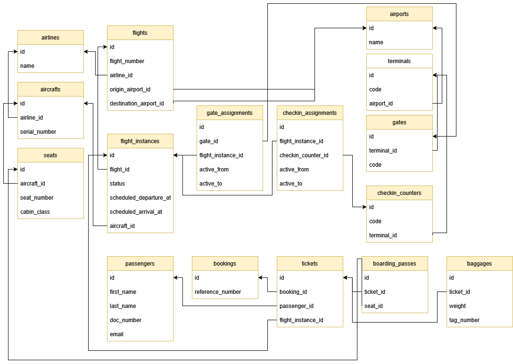

# Airport Domain Modeling

This project models an airport domain using Rails and PostgreSQL. It focuses on airlines, flights, aircraft, terminals, gates, check‑in counters, and the passenger journey from booking to boarding.

## Diagram

## Domain Assumptions

- An airport contains multiple terminals.
- Each terminal contains multiple gates and check‑in counters.
- Airlines operate flights and own aircraft.
- A flight instance is a scheduled occurrence of a flight using a specific aircraft.
- Gates and check‑in counters are assigned to flight instances for time windows.
- A ticket links a passenger to a specific flight instance and may have baggage and a boarding pass.

## Model Relationships

Below is a concise summary of each model and its table, including key fields and relationships.

### `Airport`
- **Table:** airports (name)
- **Relations:** has many `Terminal` records

### `Terminal`
- **Table:** terminals (code, airport_id)
- **Relations:** belongs to `Airport`; has many `Gate` and `CheckinCounter` records

### `Gate`
- **Table:** gates (code, terminal_id)
- **Relations:** belongs to `Terminal`; linked to `FlightInstance` via `GateAssignment`

### `CheckinCounter`
- **Table:** checkin_counters (code, terminal_id)
- **Relations:** belongs to `Terminal`; linked to `FlightInstance` via `CheckinAssignment`

### `Airline`
- **Table:** airlines (name)
- **Relations:** has many `Aircraft` and `Flight` records

### `Aircraft`
- **Table:** aircrafts (serial_number, airline_id)
- **Relations:** belongs to `Airline`; has many `Seat` and `FlightInstance` records

### `Seat`
- **Table:** seats (seat_number, cabin_class, aircraft_id)
- **Relations:** belongs to `Aircraft`; used by `BoardingPass`
- **Enums:** cabin_class = economy | business | first

### `Flight`
- **Table:** flights (flight_number, airline_id, origin_airport_id, destination_airport_id)
- **Relations:** belongs to `Airline`; belongs to origin and destination `Airport`; has many `FlightInstance` records

### `FlightInstance`
- **Table:** flight_instances (flight_id, aircraft_id, scheduled_departure_at, scheduled_arrival_at, status)
- **Relations:** belongs to `Flight` and `Aircraft`; referenced by `Ticket`, `GateAssignment`, and `CheckinAssignment`
- **Enums:** status = scheduled | boarding | delayed | departed | arrived | cancelled

### `GateAssignment`
- **Table:** gate_assignments (gate_id, flight_instance_id, active_from, active_to)
- **Purpose:** time‑boxed assignment of a gate to a flight instance

### `CheckinAssignment`
- **Table:** checkin_assignments (checkin_counter_id, flight_instance_id, active_from, active_to)
- **Purpose:** time‑boxed assignment of a check‑in counter to a flight instance

### `Booking`
- **Table:** bookings (reference_number)
- **Relations:** has many `Ticket` records

### `Passenger`
- **Table:** passengers (first_name, last_name, doc_number, email)
- **Relations:** has many `Ticket` records

### `Ticket`
- **Table:** tickets (booking_id, passenger_id, flight_instance_id)
- **Relations:** belongs to `Booking`, `Passenger`, and `FlightInstance`; has one `BoardingPass`; has many `Baggage` records

### `BoardingPass`
- **Table:** boarding_passes (ticket_id, seat_id)
- **Purpose:** assigns a seat to a ticket

### `Baggage`
- **Table:** baggages (ticket_id, weight, tag_number)
- **Relations:** belongs to `Ticket`

## Key Business Rules and Validations

- `Airport`: name required.
- `Terminal`: code required; unique per airport.
- `Gate`: code required; unique per terminal.
- `CheckinCounter`: code required; unique per terminal.
- `Airline`: name required and unique.
- `Aircraft`: serial number required and unique.
- `Seat`: seat number required; unique per aircraft; `cabin_class` limited to economy/business/first.
- `Flight`: flight number required and unique; origin and destination airports must differ.
- `FlightInstance`: scheduled departure/arrival required; status limited to scheduled/boarding/delayed/departed/arrived/cancelled.
- `GateAssignment`: active_from/active_to required; active_to must be after active_from.
- `CheckinAssignment`: active_from/active_to required; active_to must be after active_from; no overlapping assignments per counter.
- `Booking`: reference number required and unique.
- `Passenger`: first/last name required; email required and unique (format‑checked); passport/document number required and unique.
- `Baggage`: weight and tag number required; tag number unique.
